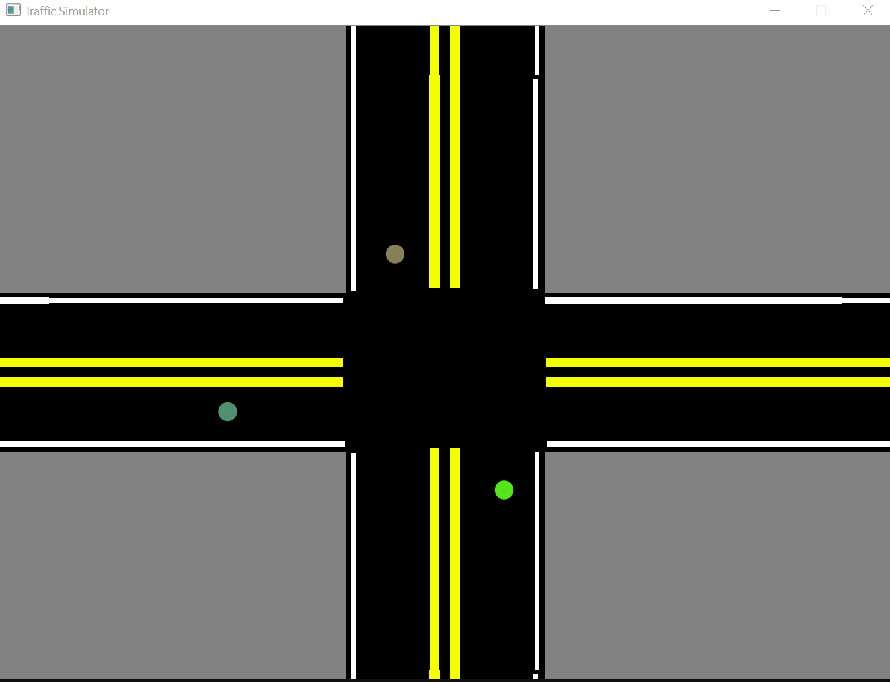

# **Traffic Trainer**

### **Authors**
*Julianus*  
*Khoa Nguyen*  
*acantusoto*  
*BrandonHC*

 

--------------
--------------

### **Outline**
How many thousand cars do you think pass through an intersection over 24 hours? Even a small one? How many over the 1440 minutes per day? What about big ones? How much time do you think people sit at traffic sections? How much gas is burned? How many emergency vehicles are blocked due to congestion? How many accidents?  
Take those thoughts, and multiply them over the hundreds of thousands of intersections in the US. And even more in the world.  
If we can make even a small improvement in traffic flow, we can save lives, time, and money.    
As a brief example, consider the average wait time is 30 seconds, with 2000 people passing through per day, where they value their time at $20 per hour. Over a year, and over the 200,000+ intersections in the US, with only a 1% improvement (.3 seconds), that's over $200 million saved per year by society, solely from a back of the napkin calculation. If the improvement is higher, you can see where it leads. Not to mention lives saved, the benefit for the environment, etc.    
A common response might be 'Who cares about a third of a second?', and it does seem trivial. How heavy my foot is that day might have more of an impact. But when we can make a large enough improvement, the benefits are undeniable. [Furthermore, serving one less olive saved American Airlines $40,000 per year](https://www.forbes.com/sites/moiravetter/2015/06/04/the-40000-olive-how-entrepreneurs-can-spend-time-saving-money/). Pennies add up to dollars.    

---------------
Traffic Trainer is an AI gym for training better traffic systems. It takes into account some of the following factors:
- Pedestrians
- Wait time of vehicles and pedestrians
- Speed & acceleration of vehicles
It's designed to be able to run a second of simulation and return back to the AI an array of data representing the state of the simulation. To run another second, the AI can then send back an array of actions to take.  
There are init functions to set up the simulation, and an end function to allocate and free the necessary memory.  
At the end of the simulation, the penalty can be viewed as a float, and used with a common framework to train the AI.  
*BTS* runs off of a randomly generated traffic file, which, for the best results, should be generated randomly every generation using a bimodal disrtribution based on the time of day.  
One of our team members took the entire competition to learn and use QT so that we could begin to have visualization functionalities.  

 

--------------
--------------

### **Hackathon Challenge**
#### **Toyota**
*Build a solution to improve the end-to-end vehicle experience. Whether it is creating a convenience service, a modern mobility solution, focusing on social good or building a new and/or enhanced experience*
We believe our project has extreme potential for social good, and by it's very nature, it is inherent to the vehicle experience.  

#### **StateFarm**
*Use technology to design a creative solution to a problem that your community currently faces*
Due to it's focus on the social good, our project is also a great fit for this challenge.  

#### **General**
We used C and C++ (QT) to build our project, and also we were able to use Python Bindings to load our C functions into Python and execute code, that way the simulation can run at native speeds, and the time for each generation can be as short as possible.  
We had hoped to further develop our visualization, but due to the difficulty with the Binding and another subject, some things were underdeveloped relative to our hopes.  
With even more time (say another 10 hours), we would have loved to refine and optimize the simulation, and create a sample AI, and show the results of generations of training with a small paper.  
Ultimately, we enjoyed the experience, and it's great to work on a problem that's common to all of us, but also challenging. Plus the bonding and good times we had among ourselves and other teams. Thank you, UTD, for hosting this event!  

 

--------------
--------------

### **Open note to programmers, AI enthusiasts, and visionaries**
This project was develop for UTD Hackathon 2022 in under 24 hours. While we quickly put a lot of manhours into it, there is absolutely potential to taking your time to better plan it out and make it better. Here are a few ideas we had for improvements we didn't have time to implement:
- Better penalty system
- Keep track of individual pedestrians
- Better feedback system for AI
- More realistic speed limits and turning speeds
  - Different turning speeds for left vs right
  - Spawn cars with different preferences to turn at higher or lower speeds
- Move cars better (we move in a clockwise motion, but realistically it should be semi-random)
- Add more functionality such as blinking red lights
- We remove car if there is a collision, but there could be more complex interactions
- Just a better simulation
  - Perhaps use CUDA to speed up the simulation
  - Make it less discrete and more continuous
- Keep track of too high of velocity or acceleration going into intersection
- Allow metric calculations

We developed this simulation to be loaded as a shared object file in Cython, and if we were to make an AI, we would make a wrapper python function to handle the C program. You will need to make sure you properly handle and encode the data from python to be understood by C.  
Share your results. Try to snoop out bugs (there's probably plenty of them). Make it better.  
We would recommend creating test cases for each function file with values that you know the output should be, although for a complex system like an intersection, that may be hard to create those kinds of tests in the beginning. In which case, we strongly recommend investing time into visualization, and testing all possible cases for 1 and 2 vehicles at a time, and scaling up your time and number of vehicles as you feel comfortable.  
We hope that we have paved the way for some improvement to the human experience.  

 

Happy Hacking!  
\- Julianus